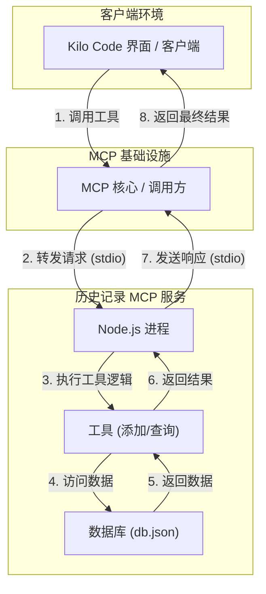

# Historical Record MCP Server

[](https://www.npmjs.com/package/historical-record-mcp-server)
[](./LICENSE)
[](https://www.typescriptlang.org/)

一个用于记录和管理 AI 交互历史的模型上下文协议 (MCP) 服务。

---

## 1. 📖 项目简介

**Historical Record MCP Server** 是一个基于 Node.js 和 TypeScript 构建的独立服务，旨在通过模型上下文协议 (MCP) 提供可靠的历史记录管理功能。它可以轻松集成到 Kilo Code 或其他客户端应用中，实现对 AI 交互对话的持久化存储、灵活查询和数据导出。

## 2. ✨ 功能特性

- 💾 **持久化存储**: 使用轻量级的 `lowdb` 将所有记录安全地存储在本地 `db.json` 文件中。
- ➕ **添加记录**: 提供简单接口，快速添加新的交互记录。
- 🔍 **高级查询**:
    - **分页查询**: 支持按页码和每页数量查询，避免一次性加载大量数据。
    - **时间范围过滤**: 可根据开始和结束日期 (ISO 8601 格式) 筛选记录。
    - **关键词搜索**: 支持在交互内容中进行不区分大小写的关键词搜索。
- 排序**: 所有记录默认按时间戳倒序排列，最新的记录总在最前面。
- 📤 **数据导出**: 支持一键导出所有符合筛选条件的记录，忽略分页限制。
- 🛡️ **类型安全**: 使用 `Zod` 对所有输入参数进行严格的模式验证，保证接口调用的健壮性。

## 3. 🚀 快速入门

请按照以下步骤在你的本地环境中启动并运行此服务。

### 环境要求

- [Node.js](https://nodejs.org/) (建议使用 v18 或更高版本)
- [Git](https://git-scm.com/)

### 安装与启动

```bash
# 1. 克隆仓库到本地
git clone https://github.com/lijiaming1009/Historical-Record-MCP-Server.git

# 2. 进入项目目录
cd Historical-Record-MCP-Server

# 3. 安装项目依赖
npm install

# 4. 编译 TypeScript 代码
npm run build

# 5. 启动服务
npm start
```

服务启动后，它会首先输出元数据信息，然后开始监听来自标准输入 (stdin) 的请求。

## 4. 🔧 技术实现

### 技术选型

- **运行环境**: Node.js
- **开发语言**: TypeScript
- **核心依赖**:
  - `lowdb`: 一个轻量级的 JSON 文件数据库，用于数据持久化。
  - `zod`: 用于定义和验证工具的输入/输出模式。
  - `uuid`: 用于为每条历史记录生成唯一的 ID。

### 架构与流程

本服务作为独立的后台进程，通过标准输入/输出 (stdio) 与 MCP 调用方进行通信。



## 5. 📖 API 参考

本服务通过标准输入/输出接收和发送 JSON 数据来调用工具。

### 5.1 `add_historical_record`

添加一条新的历史记录。

- **请求 (Input)**:
  ```json
  {
    "id": "request-123",
    "tool": "add_historical_record",
    "input": {
      "content": { "user": "Hello", "ai": "Hi there!" }
    }
  }
  ```
- **响应 (Output)**:
  ```json
  {
    "id": "request-123",
    "result": {
      "success": true,
      "id": "a1b2c3d4-e5f6-7890-1234-567890abcdef"
    }
  }
  ```

### 5.2 `get_historical_records`

查询历史记录，支持多种过滤和分页选项。

- **参数 (Input)**:
  - `page: number` (可选, 默认 1): 分页查询的页码。
  - `limit: number` (可选, 默认 20): 每页返回的记录数。
  - `startDate: string` (可选, ISO 8601 格式): 时间范围查询的开始日期。
  - `endDate: string` (可选, ISO 8601 格式): 时间范围查询的结束日期。
  - `keyword: string` (可选): 根据内容中的关键词进行搜索。
  - `export: boolean` (可选, 默认 false): 如果为 `true`，则忽略分页，返回所有符合条件的记录。

- **请求示例 (分页查询)**:
  ```json
  {
    "id": "request-456",
    "tool": "get_historical_records",
    "input": {
      "page": 1,
      "limit": 10
    }
  }
  ```

- **响应示例 (分页查询)**:
  ```json
  {
    "id": "request-456",
    "result": {
      "page": 1,
      "limit": 10,
      "total": 100,
      "data": [
        { "id": "...", "timestamp": "...", "content": "..." }
      ]
    }
  }
  ```

## 6. ⚙️ 持久化运行 (使用 PM2)

为了让服务在后台稳定运行并能随系统重启，推荐使用进程管理工具 `pm2`。

### 6.1 安装 PM2

这是一个全局安装，只需执行一次。
```bash
npm install pm2 -g
```

### 6.2 使用 PM2 启动服务

在项目根目录下运行以下命令。服务将会在后台启动。
```bash
# --name "historical-record" 为你的服务进程命名，方便后续管理
pm2 start npm --name "historical-record" -- start
```

### 6.3 管理服务

```bash
pm2 list          # 查看所有由 pm2 管理的服务状态
pm2 stop historical-record  # 停止服务
pm2 restart historical-record # 重启服务
pm2 logs historical-record  # 查看实时日志
pm2 delete historical-record # 从 pm2 列表中移除服务
```

### 6.4 设置开机自启

运行以下命令后，`pm2` 会生成一条指令，复制并执行该指令即可。
```bash
pm2 startup
```

## 7. 🤝 贡献指南

欢迎任何形式的贡献！如果你有好的想法或发现了 Bug，请遵循以下步骤：

1.  **Fork** 本仓库。
2.  创建你的特性分支 (`git checkout -b feature/AmazingFeature`)。
3.  提交你的修改 (`git commit -m 'Add some AmazingFeature'`)。
4.  将你的分支推送到远程仓库 (`git push origin feature/AmazingFeature`)。
5.  **提交一个 Pull Request**。

## 8. 📄 许可证

本项目基于 [ISC License](./LICENSE) 开源。

## 9. 📫 联系方式

作者: Jiaming Li - [GitHub](https://github.com/lijiaming1009)

项目链接: [https://github.com/lijiaming1009/Historical-Record-MCP-Server](https://github.com/lijiaming1009/Historical-Record-MCP-Server)
